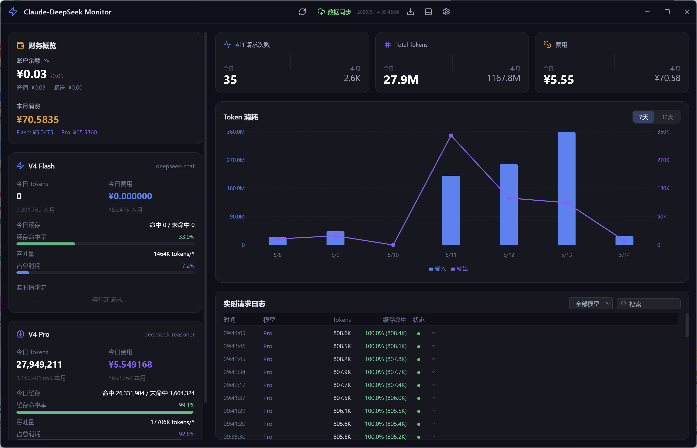

# Claude-DeepSeek Monitor

[[](https://github.com/sky8528577-source/claude-deepseek-monitor/releases/latest)
](https://electronjs.org)
[](https://react.dev)
[](https://typescriptlang.org)
[](https://tailwindcss.com)
[](LICENSE)

实时监控 Claude Code 中 DeepSeek API 用量、Token 消耗、缓存命中率及余额的桌面应用。

> [**下载安装包 (Windows)**](https://github.com/sky8528577-source/claude-deepseek-monitor/releases/latest)

---

## 功能

-  **余额监控** — 每 60 秒自动拉取 DeepSeek 账户余额，充值 / 赠送分开展示，余额变化趋势箭头
-  **月度费用** — 对接 DeepSeek 官方 Cost API，精确到每日费用明细
-  **Token 统计** — 对接官方 Amount API，Prompt / Completion 拆分，双轴图表可视化
-  **缓存命中率** — 月度 + 单次调用两级缓存效率监测，进度条展示
-  **实时请求流** — 扫描 Claude Code 本地对话日志，展示每次 API 调用的 Token 详情
-  **一键登录** — 内置浏览器窗口登录 DeepSeek 平台，自动获取认证 Token
-  **迷你悬浮窗** — 桌面置顶小窗，核心指标一目了然
-  **任务栏集成** — 系统托盘图标 + 右键菜单实时显示余额/费用
-  **全自动刷新** — 启动即拉取数据，每 60 秒增量更新，数据推送即时刷新前端
-  **深色主题** — 暗色 UI + 毛玻璃卡片风格

---

## 截图

### 主界面


### 迷你悬浮窗


---

## 安装

### 开发模式

```bash
git clone https://github.com/<your-username>/claude-deepseek-monitor.git
cd claude-deepseek-monitor
npm install
npm run dev
```

### 打包

```bash
npm run build          # 编译前后端
npm run pack           # 生成可执行文件 (release/win-unpacked/)
npm run dist           # 生成安装包
```

> 安装过程会自动运行 `electron-rebuild` 编译 `better-sqlite3` 原生模块。

---

## 技术栈

| 层 | 技术 | 说明 |
|---|---|---|
| 桌面框架 | Electron 33 | 跨平台桌面壳 |
| 前端 | React 18 + TypeScript | 渲染进程 |
| 样式 | Tailwind CSS 3 | 深色主题 |
| 图表 | Recharts | Token 消耗柱状/折线图 |
| 图标 | Lucide React | 统一图标库 |
| 状态管理 | Zustand | 轻量级 |
| 数据库 | better-sqlite3 | 本地嵌入式 SQLite |
| 定时任务 | node-cron | 每日聚合 |

---

## 数据来源

本项目通过三个渠道获取 DeepSeek 用量数据，全部对接官方：

### 1. 余额 API

```
GET https://api.deepseek.com/user/balance
Authorization: Bearer <API_Key>
```

每 60 秒轮询一次。返回账户总余额、充值余额、赠送余额。

### 2. Cost API — 费用数据

```
GET https://platform.deepseek.com/api/v0/usage/cost?month=5&year=2026
Authorization: Bearer <Token>
```

**鉴权**：通过内置浏览器窗口一键登录 `platform.deepseek.com`，自动拦截页面请求中的 `Authorization: Bearer <token>` 并持久化存储。

**响应结构**：

```json
{
  "code": 0,
  "data": {
    "biz_data": [{
      "total": [{
        "model": "deepseek-v4-pro",
        "usage": [
          { "type": "PROMPT_CACHE_HIT_TOKEN",   "amount": "14.73" },
          { "type": "PROMPT_CACHE_MISS_TOKEN",  "amount": "3.21" },
          { "type": "RESPONSE_TOKEN",           "amount": "8.66" }
        ]
      }],
      "days": [{ "date": "2026-05-01", "data": [{ "model": "deepseek-v4-pro", "usage": [...] }] }]
    }]
  }
}
```

- `total`：各模型月度费用汇总，`amount` 单位为 CNY
- `days`：每日费用明细，共 31 天
- `usage` 中的 type 代表不同计费维度（缓存命中/未命中/输出），**全部累加即为当日总费用**

### 3. Amount API — Token 数据

```
GET https://platform.deepseek.com/api/v0/usage/amount?month=5&year=2026
Authorization: Bearer <Token>
```

**响应结构**（与 Cost API 类似，但 `amount` 是 Token 数量）：

```json
{
  "biz_data": {
    "total": [{
      "model": "deepseek-v4-pro",
      "usage": [
        { "type": "PROMPT_CACHE_HIT_TOKEN",   "amount": "589411200" },
        { "type": "PROMPT_CACHE_MISS_TOKEN",  "amount": "5941016" },
        { "type": "RESPONSE_TOKEN",           "amount": "541728" },
        { "type": "REQUEST",                  "amount": "1264" }
      ]
    }],
    "days": [{ "date": "2026-05-01", "data": [...] }]
  }
}
```

- `PROMPT_CACHE_HIT_TOKEN` — 缓存命中（¥1/M tokens for Pro）
- `PROMPT_CACHE_MISS_TOKEN` — 未命中新输入（¥4/M tokens for Pro）
- `RESPONSE_TOKEN` — 模型输出（¥16/M tokens for Pro）
- `REQUEST` — API 请求次数

### 4. Claude Code 本地日志

扫描 `~/.claude/projects/**/*.jsonl`，解析每次对话的 `usage` 字段获取逐条 API 调用的 Token 用量，用于"实时请求流"展示。

---

## 数据流程

```
余额 API ───────────→ balance_snapshots 表 ──→ 财务卡片
Cost API ──→ 每日费用 ─┐                    ┌──→ 本月/今日费用
Amount API ─→ 每日Token ─┤──→ api_calls 表 ──┼──→ Token 图表
CC 日志 ──→ 单条调用 ──┘                    └──→ 实时请求流
```

Cost API 和 Amount API 的数据按**日期 + 模型**合并为同一条 `api_calls` 记录，费用取自 Cost，Token 数取自 Amount。**统计查询只使用 API 数据**（`source != 'cc-log'`），确保月度/每日费用与 `platform.deepseek.com` 网页端一致。

---

## 项目结构

```
src/
├── main/                     # Electron 主进程
│   ├── index.ts              # 启动入口 + 托盘
│   ├── api-fetcher.ts        # Cost / Amount API 数据获取
│   ├── balance-poller.ts     # 余额轮询（60s）
│   ├── cc-log-parser.ts      # Claude Code JSONL 日志解析
│   ├── database.ts           # SQLite CRUD + 统计查询
│   ├── config.ts             # YAML 配置读写
│   ├── mini-window.ts        # 迷你悬浮窗管理
│   ├── scheduler.ts          # 每日聚合任务
│   ├── ipc-handlers.ts       # IPC 通信处理
│   └── preload.ts            # 安全上下文桥接
├── renderer/                 # React 前端
│   ├── App.tsx               # 主布局 + 迷你窗路由
│   ├── components/
│   │   ├── Header.tsx        # 顶部栏（数据同步/导出/设置）
│   │   ├── BalanceCard.tsx   # 财务概览卡片
│   │   ├── FlashCard.tsx     # V4 Flash 统计
│   │   ├── ProCard.tsx       # V4 Pro 统计
│   │   ├── TokenChart.tsx    # Token 消耗双轴图表
│   │   ├── KeyMetrics.tsx    # 关键指标行
│   │   ├── RequestLog.tsx    # 实时请求日志
│   │   ├── SettingsModal.tsx # 设置面板
│   │   ├── SetupWizard.tsx   # 首次启动引导
│   │   ├── MiniWidget.tsx    # 桌面迷你悬浮窗
│   │   └── StatusBar.tsx     # 状态提示条
│   └── store/useStore.ts     # Zustand 全局状态
└── shared/types.ts           # 共享类型定义
```

---

## 配置 (`config.yaml`)

```yaml
balance:
  api_key: sk-xxx
  refresh_interval_seconds: 60

pricing:
  deepseek-chat:        # V4 Flash
    input: 0.5           # ¥/M tokens
    output: 2.0
    cache_hit: 0.07
  deepseek-reasoner:    # V4 Pro
    input: 4.0
    output: 16.0
    cache_hit: 1.0
```

---

## 数据准确性

每月费用、每日 Token 等核心统计数据直接来自 DeepSeek 官方 API（`/api/v0/usage/cost` 和 `/api/v0/usage/amount`），与 `platform.deepseek.com` 网页端数据一致。

---

## License

MIT
